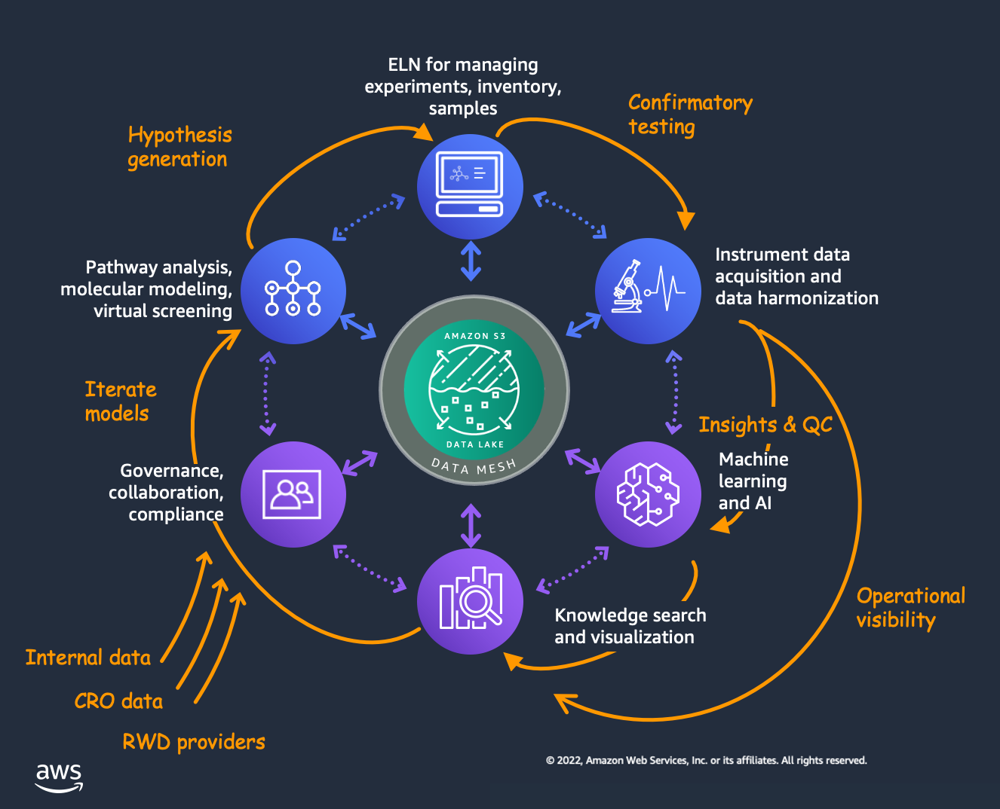

# AWS IAM Policy Lab

**Objective:**  
Created and tested IAM roles and policies following the principle of least privilege.

**Tools Used:**  
AWS IAM, CloudTrail, AWS CLI

**Steps Taken:**
1. Created IAM users and groups.
2. Applied custom JSON policies with restricted S3 permissions.
3. Verified permissions via AWS CLI and logged actions with CloudTrail.

**Key Learnings:**
- How to apply least privilege in IAM.
- Difference between policies, roles, and groups.
- How CloudTrail records IAM activity for auditing.

**Screenshot:**

**Date Completed:** October 2025
